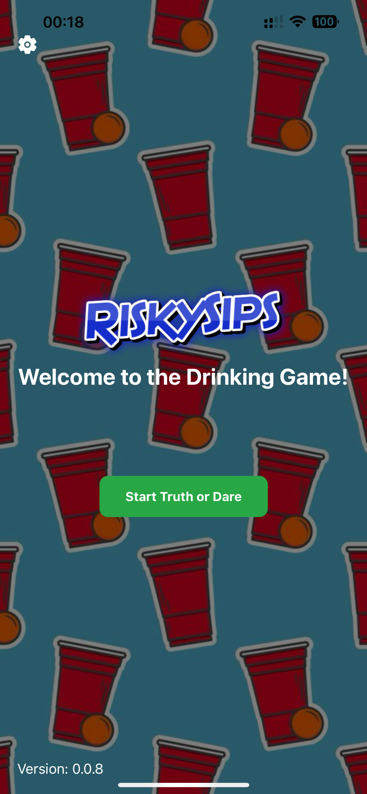
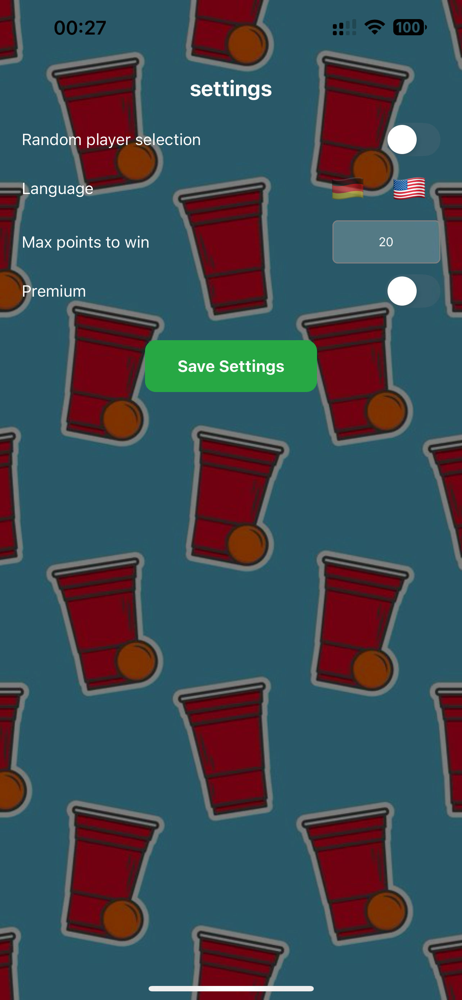
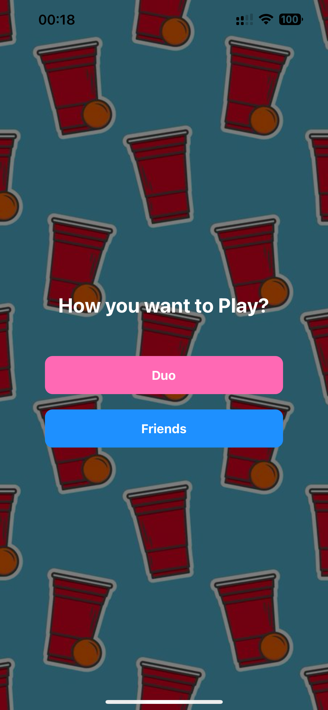
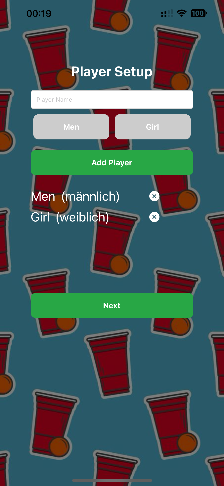
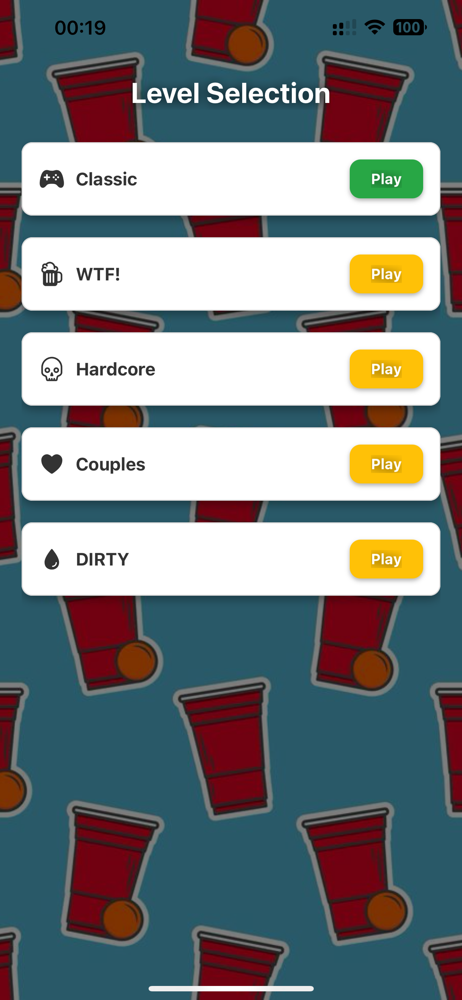
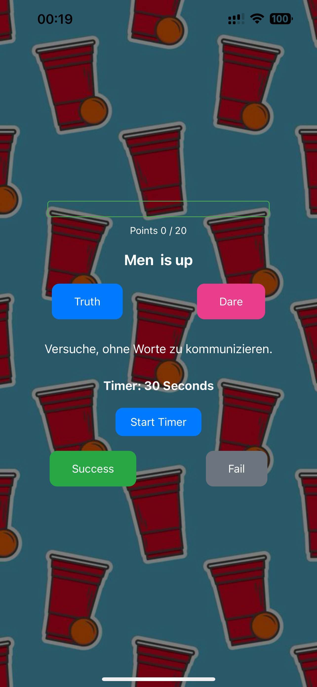
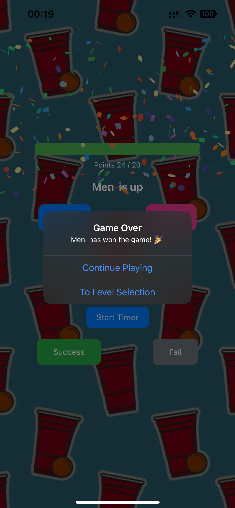

# 🍻 Risky Sips  
### The Ultimate Drinking Game  

  

Turn any gathering into an unforgettable night with **Risky Sips** – the wildest drinking game! Perfect for parties with friends or a romantic evening as a couple.  

---

## 🎲 **Game Overview**  
Ready to spice up your night?  
With crazy challenges, spicy questions, and hilarious dares, **Risky Sips** guarantees unforgettable moments and endless fun!  

---

## 📱 **Screenshots**  

### **TRUTH OR DARE GAME Screenshots**

---

## 🕹️ **How to Play**  
Choose which Game you wanna Play:
 ### Truth or Dare:  
    1. Pick your game mode: **Friends** or **Couple (DUO)**  
    2. Setup you Players
    3. Select a difficulty level – **Basic is free**, unlock crazier levels with in-app purchases  
    4. Choose **Truth** or **Dare** – then answer the question or complete the challenge!  
    5. Score points or lose them if you fail! (Random between 5 - 15 points)  
    6. First to **200 points** wins! ( you can change the max Points in the Settings :) ) 

---

## ⚡ **Features**  
- 🔥 **Multiple Levels** – From basic fun to extreme challenges!  
- 🥂 **Party or Couple Mode** – Perfect for any occasion!  
- 🎲 **Random or Sequential Turns** – Keep the suspense alive!  
- 🎁 **In-App Purchases** – Unlock crazy and dirty levels for even more fun!  
- 🏆 **Point System** – Compete to be the ultimate Risky Sips champion!  
- 🎉 **Endless Fun** – Thousands of questions and challenges to keep the party going!  

---

## 🚀 **Getting Started**  

## 🔧 **Tech Stack**

React Native & Expo – For cross-platform mobile development
TypeScript – Strong typing for robust code
In-App Purchases – Monetization through advanced levels
Context API – State management for seamless navigation and point tracking

## 🌐 **Download Now**
Coming soon on:
- App Store
- Google Play

## 📜 **License**
This project is licensed under the Apache License – see the LICENSE file for details.

🎉 Have Fun and Take a Risky Sip!
